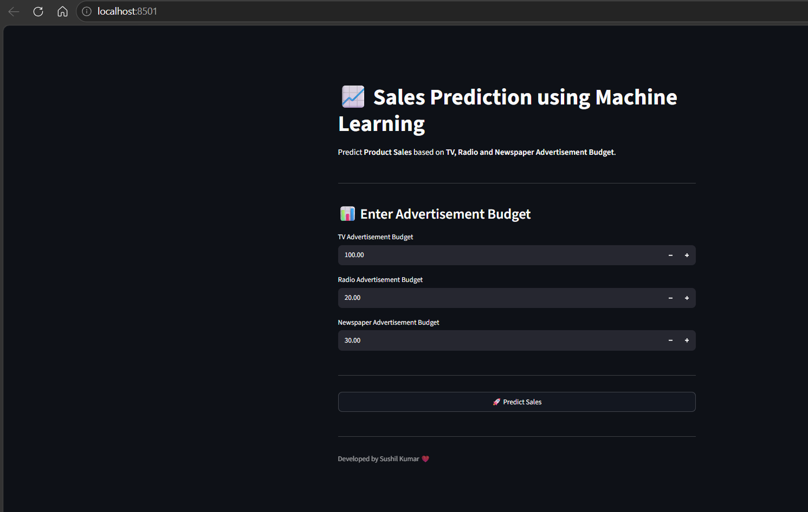
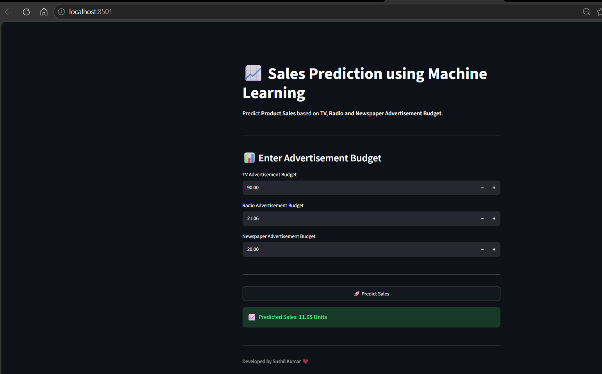
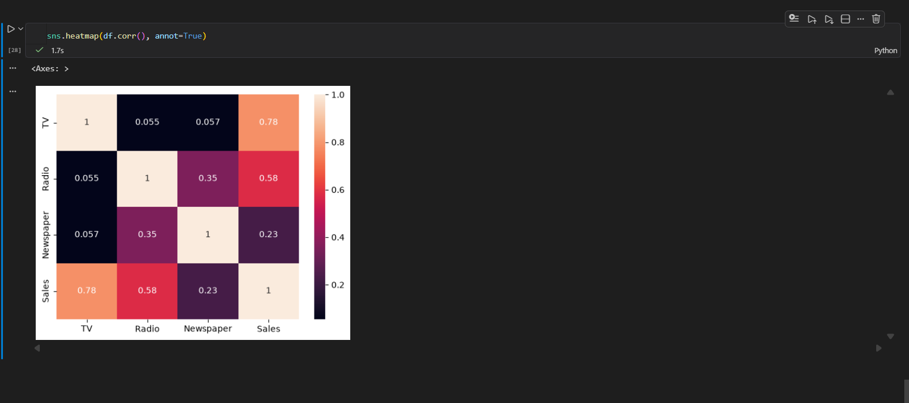
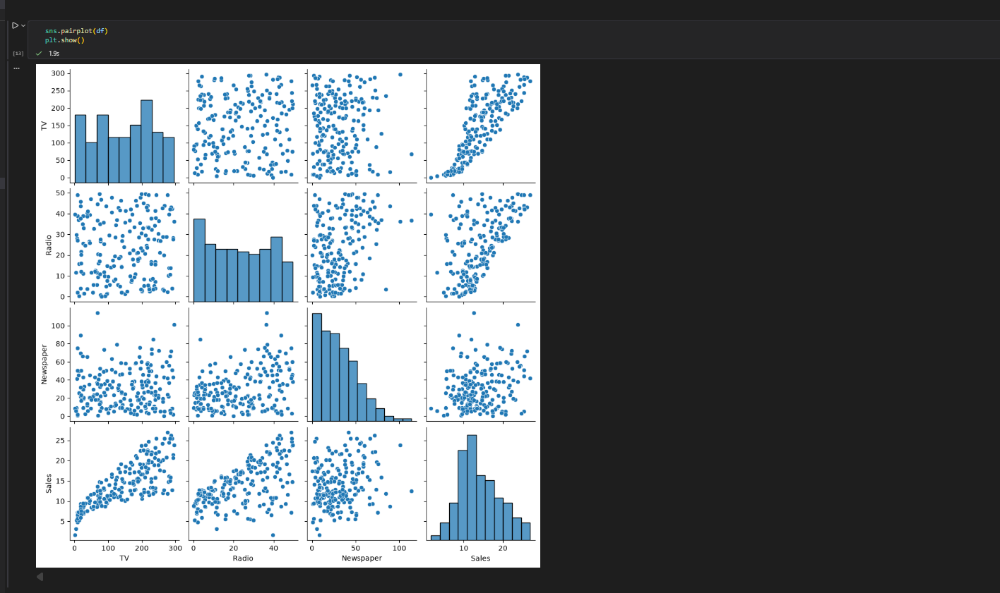
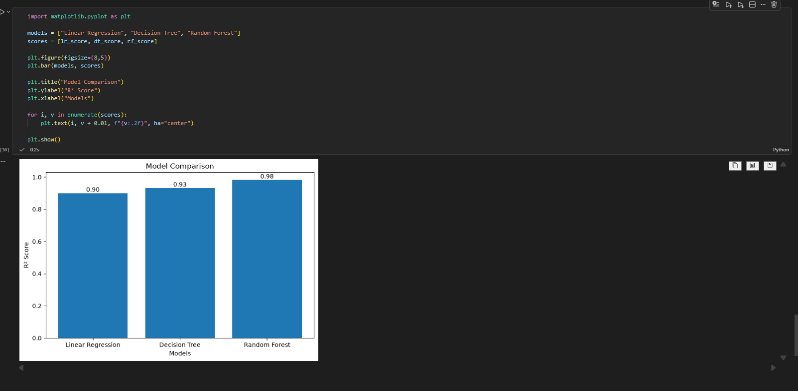

# 📈 Sales Prediction using Machine Learning

Predict product sales based on advertising expenditure using Machine Learning and Streamlit.

---

## 🚀 Live Demo

🔗 https://salespredictor-sushil.streamlit.app/

---

## 📖 Project Overview

This project predicts product sales using advertising budgets spent on **TV**, **Radio**, and **Newspaper**. It uses Machine Learning regression algorithms to estimate future sales and provides an interactive Streamlit web application for real-time predictions.

---

## ✨ Features

- 📊 Sales Prediction using Machine Learning
- 📺 TV Advertisement Budget Input
- 📻 Radio Advertisement Budget Input
- 📰 Newspaper Advertisement Budget Input
- 🤖 Random Forest Regression Model
- ⚡ Interactive Streamlit Web App
- 📈 Real-time Predictions
- 💻 User-Friendly Interface

---

## 🛠 Tech Stack

- Python
- Pandas
- NumPy
- Matplotlib
- Seaborn
- Scikit-learn
- Streamlit
- Joblib

---

## 📂 Project Structure

```text
Sales Prediction using Python/
│
├── app.py
├── requirements.txt
├── README.md
├── .gitignore
│
├── dataset/
│   └── advertising.csv
│
├── models/
│   └── sales_prediction_model.pkl
│
├── notebooks/
│   └── Sales_Prediction.ipynb
│
└── screenshots/
```

---

## 📊 Dataset

The dataset contains advertising expenditure on:

- TV
- Radio
- Newspaper

Target Variable:

- Sales

---

## 🤖 Machine Learning Model

The following regression models were trained and compared:

- Linear Regression
- Decision Tree Regressor
- ✅ Random Forest Regressor (Best Model)

The best-performing model was saved using Joblib and integrated into the Streamlit application.

---

## 📸 Screenshots

### 🏠 Home Page



---

### 📈 Prediction



---

### 🔥 Correlation Heatmap



---

### 📊 Pairplot



---

### 📉 Model Comparison



---

## ⚙ Installation

Clone the repository

```bash
git clone https://github.com/Sushil77964/sales-prediction-using-python.git
```

Go to project folder

```bash
cd sales-prediction-using-python
```

Install dependencies

```bash
pip install -r requirements.txt
```

Run the application

```bash
streamlit run app.py
```

---

## 🎯 Future Improvements

- Hyperparameter Tuning
- Model Performance Optimization
- Advanced Data Visualization
- Cloud Deployment
- Prediction History

---

## 👨‍💻 Author

**Sushil Kumar**

GitHub:
https://github.com/Sushil77964

LinkedIn:
(https://www.linkedin.com/in/sushil-kumar-501070257)

---

⭐ If you like this project, don't forget to star the repository.